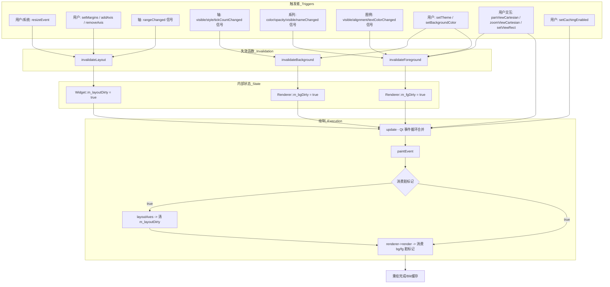

# paintEvent_flow.md —— QChartWidget::paintEvent 控制流/数据流/时序

> t55 核心函数 flow · core 模块（src/core/QChartWidget.cpp:363）

## 控制流（调用图）

```
触发方（全部经 update() → Qt 事件循环合并 → paintEvent）:
  invalidateBackground() / invalidateForeground() / invalidateLayout()
  setCachingEnabled() / setMargins() / Qt 系统（resize/expose/遮挡恢复）

paintEvent(QPaintEvent*)
  ├─ m_layoutDirty == true ?
  │    ├─ layoutAxes()              # 重算 m_plotArea（plotAreaForSize(size())）
  │    ├─ m_layoutDirty = false
  │    └─ m_renderer->invalidateBackground() + invalidateForeground()
  ├─ const QChartScene scene = buildScreenScene()      # 场景快照（3D 子类重写注入 3D 段）
  └─ m_renderer->render(scene, this)                   # 参数化渲染（QPainter 缓存路径 / GL 校验）
       └─（QPainterChartRenderer::render）→ drawBackground/drawForeground（blit 到 this）
       └─（QOpenGLChartRenderer::render）→ device==宿主校验 → 否则 qWarning（GL 由 GlHost paintGL 驱动）
```
> 本图明确展示**调用方（上游触发者）** → **失效函数（设置脏标记）** → **paintEvent（消费者）** 的完整链路。



## 数据流（入参/出参/状态变更）

| 项 | 说明 |
|---|---|
| 入参 | `QPaintEvent*`（仅触发信号，不读取绘制内容） |
| 消费状态 | `m_layoutDirty`（true → 执行布局并清脏）；`m_plotArea`（layoutAxes 重算） |
| 产出 | `QChartScene scene`（buildScreenScene 填充：plotArea/dataBounds/viewRect/projection/axes/layers/backgroundColor/legend/legendItems + 3D 段） |
| 出参 | device 上绘制结果（经 renderer）；`m_renderer` 内部缓存（bg/fg QPixmap，脏则重建） |
| 状态变更 | `m_layoutDirty` true→false；renderer 脏标记消费（m_bgDirty/m_fgDirty → false） |

## 时序（触发时机与先后）

1. **异步合并**：任意 `invalidate*()`/`setCachingEnabled()` 调用 `update()`——Qt 同帧合并多次 update，paintEvent 每帧至多一次。
2. **布局先于绘制**：`m_layoutDirty` 时先在 paintEvent 内执行 layoutAxes（延迟布局——invalidateLayout 只置脏不立即布局），再组装场景。
3. **快照后渲染**：场景组装（buildScreenScene）与渲染（render）分离——渲染器只依赖快照 + device，不反向依赖 Widget（D2 契约）。
4. **绘制顺序（QPainter 路径）**：背景缓存 blit → 前景缓存 blit（各含 antialiasing；dpr 对齐，见 render_flow）。
5. **3D 差异**：QChartWidget3D 的屏显不走本路径的 renderer 分支——GlHost（内嵌 QOpenGLWidget）由自身 paintGL 驱动（GL 主 pass + QPainter overlay）；本 paintEvent 的 render 调用对 GL 后端仅校验 device（qWarning 兜底）。

## 关联

- Called By 全量：见 docs/core/QChartWidget.md Overrided Qt Events。
- 场景组装细节：docs/core/buildScreenScene_flow.md；渲染细节：docs/core/render_flow.md。
- 相关决策：D2（参数化渲染）、D13（导出 renderUncached）、D17（buildScreenScene 虚化钩子）。
